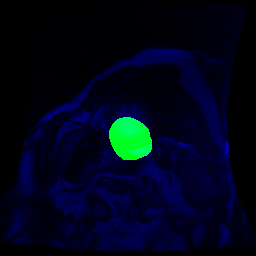
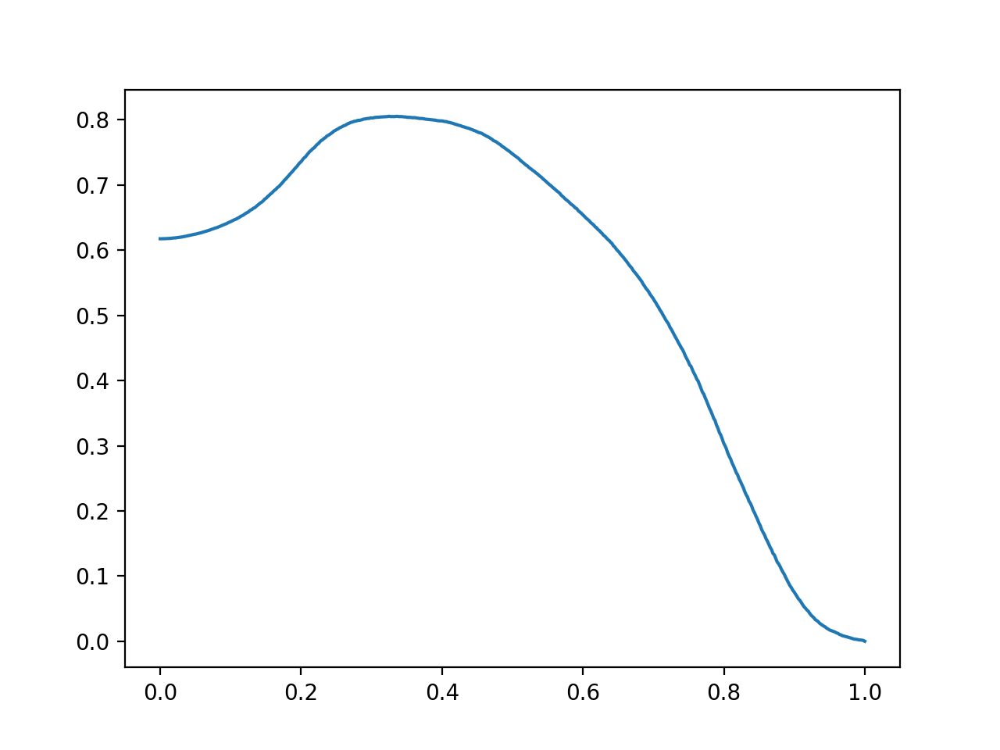
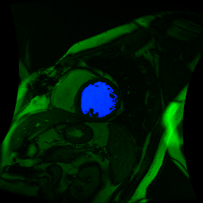
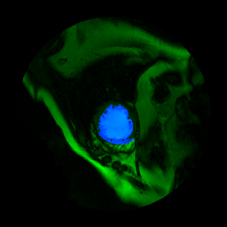
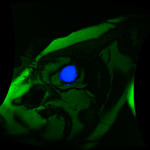
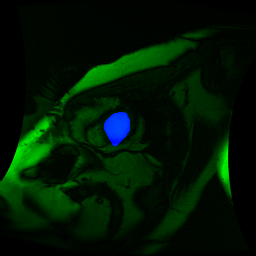

# Part 1: Part 1: Parse the o-contours

I made a couple of changes to the code.
1) The process.py script now saves any image that has either an i-contour or an i-contour to an npz
file along with whichever contour exists.  It creates three fileslists instead of one,
i_contour.txt,o_contour.txt,and both contour.txt
2) Reader.py
3) One way that I was checking my output was by saving overlaid images and contours.  This was pulled
out of the process.py script. into its own script.  Using this to check the o-contours, I was able
to see that the o-contours associated with patient 501 were not properly aligned, and removed them from
the list.

See e.g.:


# Part 2: Heuristic LV Segmentation approaches

The 'analyze_contours.py' function contains all the code necessary to perform the subsequent evaluations.

1) Pixel Intensity Differences:
Using the raw pixel intensities from the dicom files, I found that the region inside of the
i-contours had a mean pixel intensity of 123.72 units higher than the region between the o-contours and i-contours.

I rescaled the intensities of the images, such that they would all fall between 0 and 1.  I applied
the o-contour mask to the image before performing this scaling.  With this processing, the region inside
of the i-contours had a mean pixel intensity that was .3556 higher.

2) Thresholding:
I used a brute force approach to determine what the best threshold value was for this data.  I evaluated the quality of the segmentations with the Jaccard index,
which can be stated as the intersect of the segmentations over the union.

Scaling the images as described above improved the performance.  The best values and Jaccard scores were:
```
Raw:
102.4749498997996	0.7718760000007664

Scaled:
0.3366733466933867	0.8053286145718292
```
This is a plot of the thresholds for the scaled values:


The files 'raw_threshold_scores.txt' and 'scaled_threshold_scores.txt' contain the full results of the experiment.

3) Evaluation

A Jaccard score of around 80% is reasonable, but probably wouldn't be something you would want
to build a system around.  Thresholding can never provide a perfect solution when there are higher intensity
pixels in the lower intensity regions and vice versa.  

Looking at the results more closely, I observed the following issues:
i. There are holes and missing portions (darker pixels) in the segmented blood pool.
An example is here:



ii. In many of the segmentations, the predicted blood pool spills (no pun...) into the
region between the o-contour and the i-contour.  An example is here:



iii. Similarly, there are a number of intense pixels on the outside of the o-contour.  
As an example:



4) Other heuristic approaches:

I tried a couple of heuristic approaches to creating the i_contour beyond simple thresholding.  The first two were based on adding some processing around the thresholding, where as for last,I use edge detection instead.  This was the most effective approach that I found.  

###### Improving Thresholding?
To fix the first identified problem, we can transform a mask into its convex hull.  This will get rid of holes
or missing portions around the edges.  This should let us raise the threshold values, which may help with the 'leakage.'
Lastly, removing small connected components might fix the third issue.  

Adding these two features, the Jaccard score improved to .827, an improvement of 2.73% over the scaled baseline.  

Looking at these results, one can see that the outlying points and holes and such have been removed,
but that it still doesn't always find the muscle boundary that well - as seen here.



I was also able to get essentially the same Jaccard score by applying a Gaussian Blur and then doing the thresholding.  

###### Canny edge detector + convex hull
As the problem with the above approach was finding
the edge between the muscle and blood pool, it makes sense to use a more explicit edge detector.  It seemed before that the areas of the muscle close to the higher intensity areas of the blood pool had higher intensities than elsewhere in the blood pool.  Thresholding can't overcome this, but an edge detector can determine that this muscle has lower intensity than the adjacent blood pool.  I used the canny edge detector as it adds filtering and edge tracking to extract strong, continuous edges.  Combing this with a convex hull, I was able to get a Jaccard score of .872 - an improvement of 8.3%.

Images showing these masks are included in the 'canny' directory
